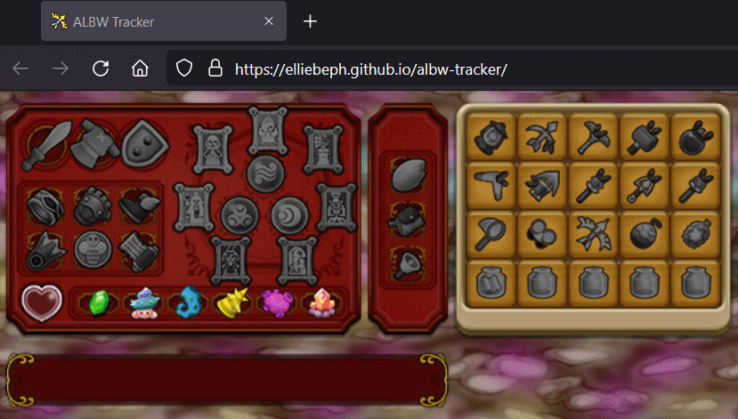

# ALBW Randomizer Tracker 📝

 [](https://github.com/elliebeph/albw-tracker/actions) 

This is a [web based tracker](https://elliebeph.github.io/albw-tracker) for the [A link Between Worlds Randomizer](https://gitlab.com/marsolk/albw-randomizer-cli).

Visit the [ALBW Randomizer discord](https://discord.gg/dmAJh2uY7M) for randomizer specific information.

## Getting Started 🛫

* Go to [**elliebeph.github.io/albw-tracker**](https://elliebeph.github.io/albw-tracker)
* Mark off the obtainables you find as you play through the game
  * Left click to upgrade an obtainable (e.g. Power Glove -> Titan's Mitt)
  * Right click to downgrade an obtainable (e.g. Titan's Mitt -> Power Glove)

[](https://elliebeph.github.io/albw-tracker)

## Existing Features 🔆

* Gear and Item tracking 🏹
* Mouse over tooltip label 🏷️

## Currently Working On 🔧

* Maps! 🗺️

## Upcoming (hopefully 🤞) Features 📅

* Location tracking 🧭
* Stats 🛰️
* Logic 🧠
* Customisation 🎨
  * Exclude checks 🚫
  * Upload presets 📤
  * Set starting items 🧾
* Save progress 💾
* Load progress 🔌

## Dev Branch 🔧

If you are keen to try out the very latest version of the tracker, this is the place for you!

**BE WARNED:** the development deployment ~~may~~ will have bugs, be broken, not work, etc.

Still interested? Then go [here](https://elliebeph.com/albw-tracker) to try it out.

## Build Instructions 🧩

To locally build and run the tracker, you will need to first install [Node.js and npm](https://www.npmjs.com/get-npm).

Clone this repository:
```bash
git clone https://github.com/elliebeph/albw-tracker.git
```

Install the required dependencies:
```bash
npm install
```

Then build and start the tracker:
```bash
npm start
```

## Shoutouts 📣

* [tocapa](https://gitlab.com/marsolk) ~ For creating the [A Link Between Worlds Randomizer](https://gitlab.com/marsolk/albw-randomizer-cli) and making this possible
* [wooferzfg](https://github.com/wooferzfg) ~ For creating the tracker for [The Wind Waker Randomizer](https://github.com/wooferzfg/tww-rando-tracker) which this tracker is based upon
* [cjs](https://github.com/cjs8487) ~ For creating the tracker for [Skyward Sword Randomizer](https://github.com/cjs8487/SS-Randomizer-Tracker)
